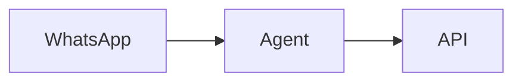

# Documentation Style Guide

> Standards for writing consistent, clear documentation.

**Last Updated:** 2026-02-23  
**Maintainer:** Sage

---

## Document Structure

### Required Header
Every doc should start with a header block:

```markdown
# Document Title

**Status:** Draft | Ready for Review | Current | Deprecated  
**Author:** Name  
**Date:** YYYY-MM-DD  
**Related:** #123 (optional ticket reference)

---
```

### Table of Contents
Include for docs longer than 3 sections:

```markdown
## Table of Contents

1. [Section One](#section-one)
2. [Section Two](#section-two)
```

---

## File Naming

### Convention
```
XXX-kebab-case-title.md
```

- **XXX** — Three-digit number for ordering (design docs only)
- **kebab-case** — Lowercase, hyphens between words
- **Descriptive** — Name describes content

### Examples
✅ Good:
- `001-mvp-inspection-workflow.md`
- `deployment.md`
- `getting-started.md`

❌ Bad:
- `DeploymentGuide.md` (no PascalCase)
- `deployment_guide.md` (no underscores)
- `doc1.md` (not descriptive)

### Directory Structure
```
docs/
├── INDEX.md              # Documentation map
├── style-guide.md        # This file
├── architecture.md       # High-level overview
├── api/                  # API reference
├── design/               # Architecture & design specs
│   └── ui/               # UI specifications
├── user/                 # End-user guides
├── ops/                  # Operations docs
├── requirements/         # PRDs and requirements
├── research/             # Analysis and research
├── developer/            # Developer docs
└── ops/                  # Operations docs
```

---

## Writing Style

### Voice
- **Active voice** preferred: "The system generates a report" not "A report is generated"
- **Direct address**: "You can configure..." not "Users can configure..."
- **Present tense**: "This creates..." not "This will create..."

### Tone
- Professional but approachable
- Concise — say more with less
- Helpful — anticipate questions

### Clarity
- One idea per sentence
- Short paragraphs (3-4 sentences max)
- Define acronyms on first use: "MCP (Model Context Protocol)"

---

## Formatting

### Headings
```markdown
# H1 — Document title (one per doc)
## H2 — Major sections
### H3 — Subsections
#### H4 — Use sparingly
```

### Code Blocks
Always specify language:

```markdown
```bash
npm install
```

```typescript
const api = new ApiClient();
```

```yaml
version: 1.0
```
```

### Inline Code
Use backticks for:
- File names: `config.yaml`
- Commands: `npm run dev`
- Code references: `ApiClient`
- Environment variables: `DATABASE_URL`

### Lists
Use bullet lists for unordered items:
```markdown
- Item one
- Item two
- Item three
```

Use numbered lists for sequences:
```markdown
1. First step
2. Second step
3. Third step
```

### Tables
Use for structured data:

```markdown
| Column A | Column B | Column C |
|----------|----------|----------|
| Value 1  | Value 2  | Value 3  |
```

### Callouts
Use blockquotes for important notes:

```markdown
> ⚠️ **Warning:** This will delete data.

> 💡 **Tip:** Use `--dry-run` to preview changes.

> 📝 **Note:** Requires admin access.
```

---

## Terminology

Use consistent terms throughout:

| Use | Don't Use |
|-----|-----------|
| inspector | user, operator |
| inspection | survey, audit |
| finding | issue, defect, item |
| project | job, case |
| report | document, PDF |
| web UI | frontend, web app, dashboard |
| API | backend, server |
| WhatsApp | WA, messaging |

---

## Links

### Internal Links
Use relative paths:
```markdown
See [Deployment Runbook](ops/deployment.md)
```

### External Links
Include descriptive text:
```markdown
See [Railway documentation](https://docs.railway.app/)
```

### Ticket References
Link to GitHub issues:
```markdown
See #123 for details.
Related: #456, #789
```

---

## Images & Diagrams

### Placement
Store in `docs/images/` with descriptive names:
```
docs/images/architecture-overview.png
docs/images/inspection-workflow.png
```

### Alt Text
Always include:
```markdown

```

### Diagrams
Prefer text-based diagrams (Mermaid, ASCII) for maintainability:

```markdown

```

---

## Versioning

### Status Values
- **Draft** — Work in progress
- **Ready for Review** — Complete, needs review
- **Current** — Approved and accurate
- **Deprecated** — Outdated, kept for reference

### Change Log
For major docs, include a change log:

```markdown
## Change Log

| Date | Author | Change |
|------|--------|--------|
| 2026-02-23 | Sage | Initial version |
| 2026-02-24 | Alex | Added API section |
```

---

## Review Checklist

Before submitting docs:

- [ ] Header block complete (status, author, date)
- [ ] Spell check passed
- [ ] Links tested
- [ ] Code blocks have language specified
- [ ] Terminology consistent
- [ ] Added to INDEX.md
